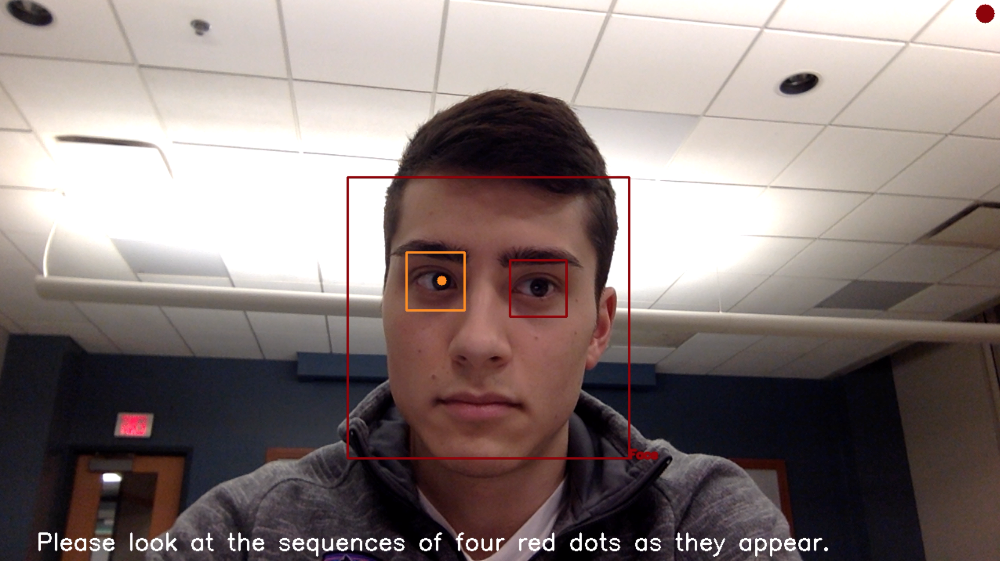
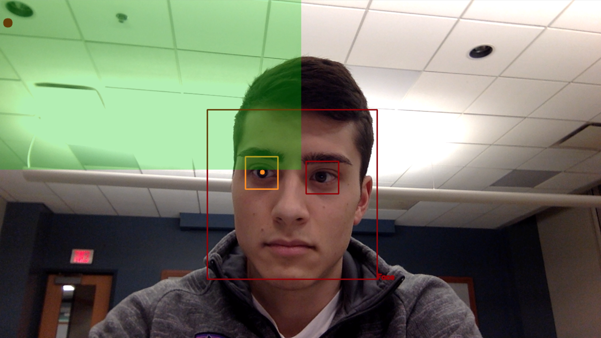

# iTracking: Low Cost Eye Tracking System

Senior Design Project

# Introduction
Current eye trackers are expensive and require licenses for each user, driving up research costs. Use in child behavior research poses additional difficulties, including following subject movement and managing lighting conditions.
While this project was done as a part of a group with Minh Chung, Pam Karwowski, Matthew Kernen, Jefferson Kim, and Myungjoon Lee, *the non-forked code in this repository was solely and exclusively my work*. See the final [poster](./final_poster.pdf) and [report](./final_report.pdf) for more information.

# Objectives
- Real time face identification
- Determine facial landmarks and locate eyes
- Stable performance in various lighting
- Unaffected by user movement
- Low-cost and portable

# System Design
- Hardware
    - Google AIY Vision Kit
    - Stepper Motors (WIP)
- Software
    - Neural Network (TensorFlow)
    - OpenCV (Python)

# Implementation
This program uses Open CV's cascading classifiers and established databases for first genderal face and eye detection. It will purposely only track the gaze of the closest face. From the eye bounding box, an algorithm that detects the group of contours closest to the center produces an approximation of the pupil and is marked with a yellow dot.

A four-point calibration with red dots allows a boundary-mapping to occur between the bounding box of the eye and the edges of the web cam window after a trim mean is applied that removes the first ¼ of the data and the 0.25 outliers. The boundary-mapping provides a reasonable estimation of gaze location. The calculated gaze location is identified by a red-dot and the quadrant is identified by a translucent green overlay.

An optional accuracy tests presents a moving blue dot. The x- and y-coordinates of the dot is treated as the ground truth and compared with the calculated gaze location.

# Instructions:
After cloning the repository, an example execution is as follows:
```
cd Open\ CV\ Eye\ Detection/
python3 eye_detector.py 0 5 True
```

# Results



Pupil centered eye tracking has limited freedom of movement and is sensitive to extreme lighting changes
After 6 tests, the quadrant accuracy was calculated to be 58.98% (and point accuracy within 1/10 of the screen, or 128 px, was calculated to be 11.38%).

# Future Work
Implement infrared illumination and infrared camera to improve accuracy
Implement Corneal Reflection Method to track gaze
Transfer algorithm to Raspberry Pi Camera
Head mounted design to aid in calibration maintenance
Integrate two AIY kits with motors

# Acknowledgements
Our deepest gratitude goes out to the individuals who had an impact on our project:
Dr. Daniel Levin (Peabody)
Dr. Ralph Bruce
Charles Gerrity
Vanderbilt School of Engineering
